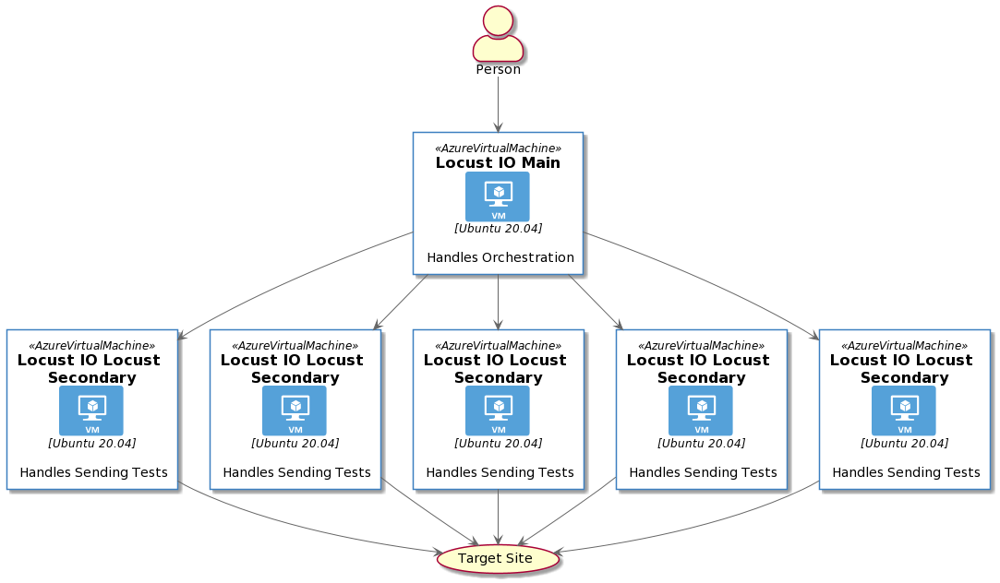

# Bicep Scale Testing using Locust IO

The purpose of this repository is to show an example of how to deploy [Locust IO](https://locust.io/) on a set of virtual machines using [Bicep](https://docs.microsoft.com/en-us/azure/azure-resource-manager/templates/bicep-overview)

## Architecture



## Getting Started

1. Clone the repository
1. Run the following command

``` bash
./run-bicep.sh -p resourcePrefix -s resourceSuffix -g resourceGroupName -l resourceGroupLocation
```

Once the script completes we should be able to visit https://{resourcePrefix}mavm{resourceSuffix}.{resourceGroupLocation}.cloudapp.azure.com:8089/ in our web browser and run Locust IO from that point.

## Code Description

